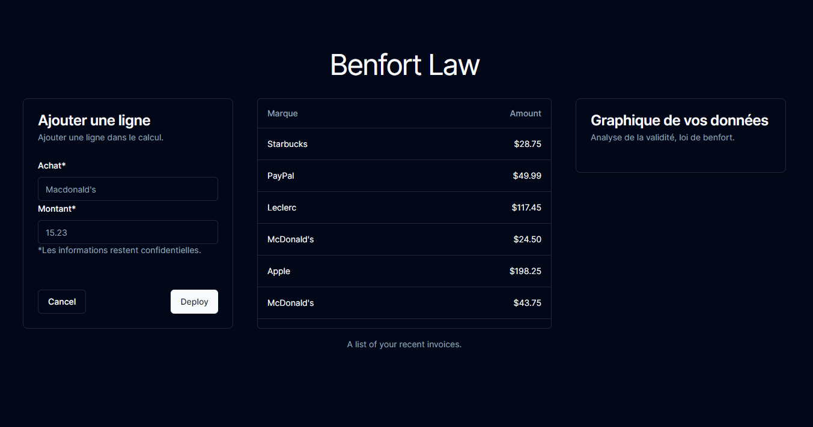

# Benfort Law Simulation

## Description
This project is a web application designed to test and simulate the Benfort Law. Benfort Law, also known as [provide a brief description of the law], is [insert any relevant background information].

## Features
- add row
- see data
- see graphic

## Screenshots


## Getting Started
These instructions will help you set up and run the simulation on your local machine.

### Prerequisites
- nodeJS
- NextJS

### Installation
1. Clone the repository: 
   ```bash
   git clone https://github.com/M-U-C-K-A/benfort-law-simulation.git
